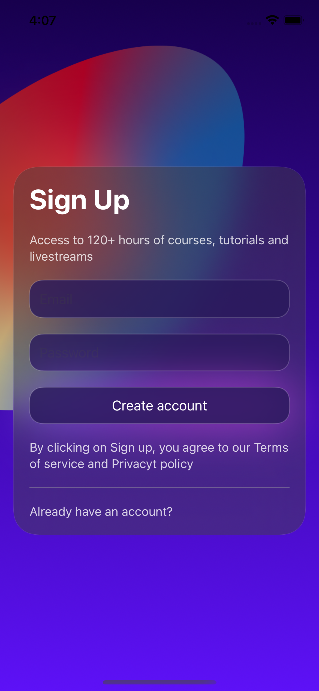

# SwiftUI Log In Screen
SwiftUI, a log in screen follow the livestream tutorial by [MengTo](https://twitter.com/MengTo), with extra feature added myself like drag animation.

# Menu
* [Screenshots](#screenshots)
* [Features](#features)
* [To-Do](#to-do)
* [Source](#source)
* [Contributions](#contributions)
* [Contact](#contact)

# Screenshots

# Features
Launch Animation: 

### To-Do
* Drag The Card Animation

# Source
This log in screen follow the livestream tutorial by [MengTo](https://twitter.com/MengTo)

# Contributions

* All kinds of contributions (enhancements, new features, documentation & code improvements, issues & bugs reporting & todo task) are welcome. Let's make it better.

# Contact
Created by [@ArgonYoYo](https://twitter.com/ArgonYoYo) - feel free to contact me!
