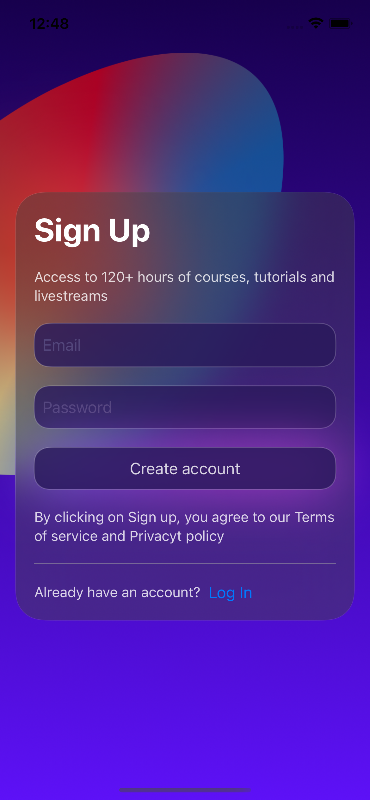
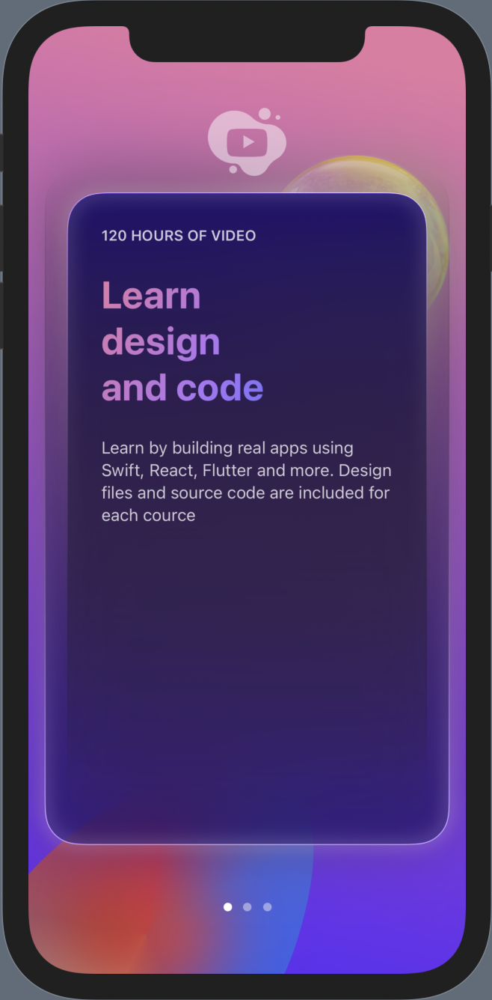
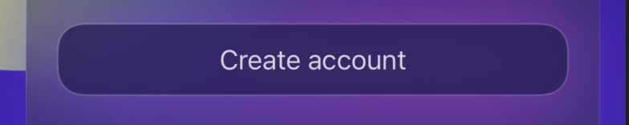
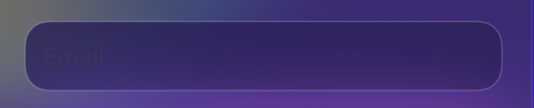
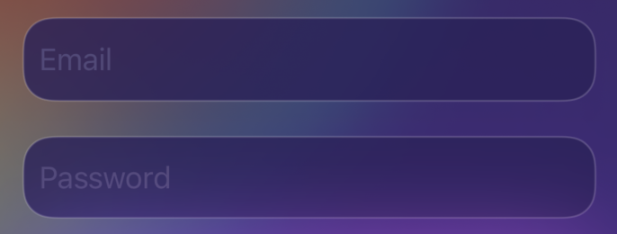

# SwiftUI Log In Screen
SwiftUI, a log in screen and onBoard screen follow the livestream tutorial by [MengTo](https://twitter.com/MengTo), with some extra features added myself like drag animation etc...

# Menu
* [Screenshots](#screenshots)
* [Features](#features)
* [To-Do](#to-do)
* [Source](#source)
* [Contributions](#contributions)
* [Contact](#contact)

# Screenshots

# Features
* Glowing Effect:

* Launch Animation: 

* Drag Animation

* Custom TextField for placeholder customization

Before: 

After:

* SwiftUIX library for blur effect
* TabView tagging

### To-Do
* Drag The Card Animation(Done)

# Source
This screen follow the livestream tutorial by [MengTo](https://twitter.com/MengTo), developed all by SwiftUI.

# Contributions

* All kinds of contributions (enhancements, new features, documentation & code improvements, issues & bugs reporting & todo task) are welcome. Let's make it better.

# Contact
Created by [@TerryKuo](https://twitter.com/ArgonYoYo) - feel free to contact me!
